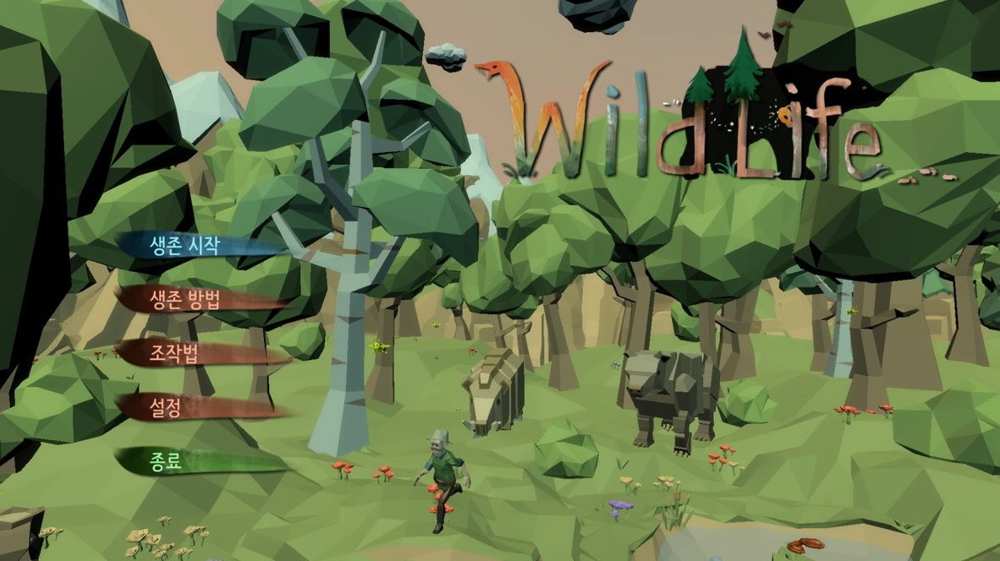
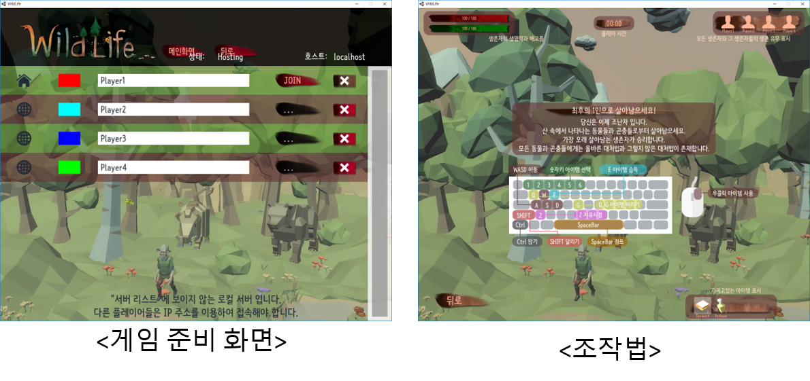
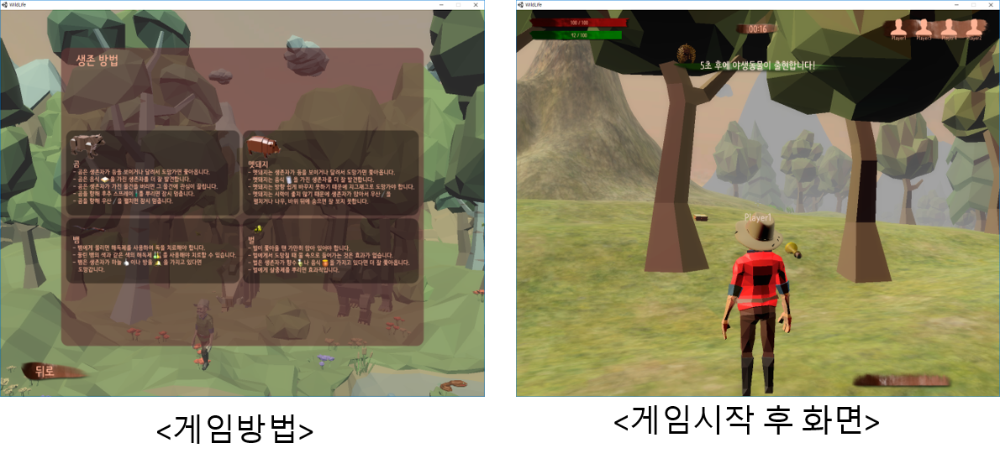
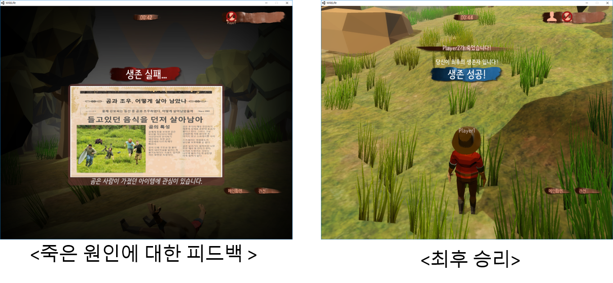

## WildLife

### 시연영상

- 개발 엔진 : Unity5.6.6
- 개발 언어 : C#
- 플랫폼 : PC

---

### **프로젝트 소개**
- 최대 4명의 플레이어가 네트워크로 연결하여 플레이하며 야생동물에게 살아남는 것이 목적인 게임입니다. 
- 야생동물에게 현실에서 대처하는 방법들과 아이템사용을 통해 가장 오래 살아남는 것이 게임의 목표입니다. 

- 게임이 시작되면 각 플레이어는 생존에 필요한 아이템을 수집하여야 하고 야생동물이 몇 초 뒤에 맵의 랜덤위치에 생성됩니다. 
- 이때 모았던 아이템들과 실제 야생동물 대처방법을 통해 야생동물로부터 살아남아야 합니다.

- 야생동물에 대처하지 못하거나 먹을 것을 구하지 못해 죽게 되면 죽은 원인에 대한 피드백으로 게임을 통해 배울 수 있고 다른 플레이어의 플레이를 관전할 수 있습니다.
- 최후의 1명을 제외하고 죽게 되면 게임은 끝나게 됩니다.

---

### **배운점**

- 졸업프로젝트로 만든 게임이다 보니 기존에 만들었던 게임들과는 달리 오랜 시간 투자하여 만든 게임입니다. 
- 소프트웨어 공학 설계에서 배운 내용을 기반으로 설계부터 시작하여 구현까지 하다 보니 게임 한가지를 완성하는데 쉬운 일이 아니라는 것을 배웠습니다. 
- 프로젝트가 커지다 보니 문서 관리의 필요성 및 설계의 중요성을 느꼈습니다. 